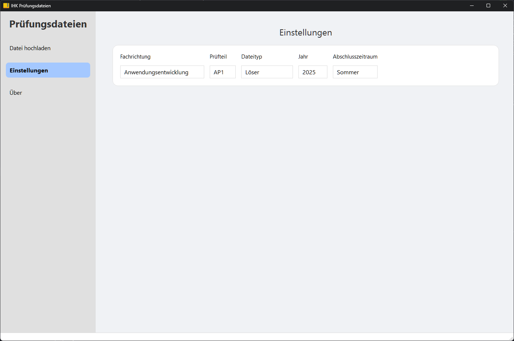

# Prüfungsdateien hochladen

**Prüfungsdateien hochladen** ist eine Desktop-Anwendung, die das geordnete Umbenennen und Sortieren von Prüfungsdateien ermöglicht.

## Inhaltsverzeichnis

- [Prüfungsdateien hochladen](#prüfungsdateien-hochladen)
  - [Inhaltsverzeichnis](#inhaltsverzeichnis)
  - [Features](#features)
  - [Demo](#demo)
  - [Technologien](#technologien)
  - [Voraussetzungen](#voraussetzungen)
  - [Installation](#installation)
    - [1. Repository klonen](#1-repository-klonen)
    - [2. Virtuelle Umgebung einrichten](#2-virtuelle-umgebung-einrichten)
      - [Mit `venv`:](#mit-venv)
    - [3. Abhängigkeiten installieren](#3-abhängigkeiten-installieren)
  - [Lokaler Betrieb](#lokaler-betrieb)
  - [Erstellung von ausführbaren Dateien](#erstellung-von-ausführbaren-dateien)
    - [Für Windows](#für-windows)
    - [Für macOS](#für-macos)
    - [Für Linux](#für-linux)
  - [Projektstruktur](#projektstruktur)
  - [Verwendung](#verwendung)
    - [Starten der Anwendung](#starten-der-anwendung)
    - [Anwendungsschritte](#anwendungsschritte)

## Features

- **Drag & Drop:** Einfaches Ziehen und Ablegen von Dateien in die Anwendung.
- **Filteroptionen:** Fachrichtung, Prüfungsteil, Dateityp, Jahr und Zeitraum festlegen.
- **Benutzerfreundliches Design:** Simples und intuitives Design.

## Demo


*Screenshot der Hauptoberfläche.*



*Screenshot der Einstellungs-Seite.*

## Technologien

- **Programmiersprache:** Python 3.12.3
- **GUI-Framework:** PyQt6
- **Packaging:** PyInstaller
- **Weitere verwendete Bibliotheken:** os, sys, datetime

## Voraussetzungen

Folgende Voraussetzungen müssen erfüllt sein:

- **Python 3.9 oder höher**
- **pip** (Python-Paketmanager)
- **Git** (für das Klonen des Repositorys)
- **PyQt6** (wird durch `requirements.txt` installiert)

## Installation

### 1. Repository klonen

Klonen Sie das Repository auf Ihr System:

```bash
git clone https://github.com/jpape1/pruefungsdateien.git
```

Navigieren Sie anschließend ins Verzeichnis:

```bash
cd pruefungsdateien
```

### 2. Virtuelle Umgebung einrichten

Zur Installation der Abhängigkeiten sollte eine virtuelle Umgebung verwendet werden.

#### Mit `venv`:

```bash
python -m venv venv
```

Virtuelle Umgebung aktivieren:

- **Windows:**

  ```bash
  venv\Scripts\activate
  ```

- **macOS und Linux:**

  ```bash
  source venv/bin/activate
  ```

### 3. Abhängigkeiten installieren

Benötigte Pakete mit `pip` installieren:

```bash
pip install -r requirements.txt
```

## Lokaler Betrieb

Sie können die Anwendung in der Entwicklungsumgebung wie folgt starten:

```bash
python main.py
```

## Erstellung von ausführbaren Dateien

Mit **PyInstaller** können für die gängigsten Betriebssysteme ausführbare Dateien erstellt werden:

### Für Windows

1. **Erstellen Sie die ausführbare Datei:**

   ```bash
   pyinstaller --onefile --windowed --icon=resources/icon.ico --name=Prüfungsdateien main.py
   ```

   ⚠️ **Hinweis**: Falls der Windows Defender die Ausführung der Datei blockiert, liegt das daran, dass unsignierte .exe-Dateien mit integriertem Python Interpreter häufig (fälschlicherweise) als Virus kategorisiert werden. In diesem Fall muss die .exe-Datei ohne die Option `--onefile` kompiliert werden. Das führt allerdings dazu, dass die Datei anschließend nur innerhalb des erzeugten `dist/`-Ordners verwendet werden kann, da sie auf zusätzlich Dateien in diesem Verzeichnis angewiesen ist.
   ```bash
   pyinstaller --windowed --icon=resources/icon.ico --name=Prüfungsdateien main.py
   ```

2. **Ausführbare Datei finden:**

   Nach Abschluss des Vorgangs finden Sie die ausführbare Datei im Verzeichnis `dist`.

### Für macOS

1. **Erstellen Sie die ausführbare Datei:**

   ```bash
   pyinstaller --onefile --windowed --name=Prüfungsdateien main.py
   ```

2. **Ausführbare Datei finden:**

   Die ausführbare Datei befindet sich im Verzeichnis `dist`.

### Für Linux

1. **Erstellen Sie die ausführbare Datei:**

   ```bash
   pyinstaller --onefile --windowed --name=Prüfungsdateien main.py
   ```

2. **Ausführbare Datei finden:**

   Die ausführbare Datei befindet sich im Verzeichnis `dist`.

## Projektstruktur

```
pruefungsdateien-hochladen/
├── config/
│   └── config.py
├── core/
│   └── file_processor.py
├── resources/
│   ├── icon.ico
│   ├── icon.png
│   ├── styles.qss
│   ├── demo1.png
│   └── demo2.png
├── ui/
│   ├── components/
│   │   ├── drag_drop_section.py
│   │   ├── settings_section.py
│   │   └── sidebar.py
│   ├── pages/
│   │   ├── about_page.py
│   │   ├── settings_page.py
│   │   └── upload_page.py
│   └── main_window.py
├── main.py
├── requirements.txt
├── .gitignore
└── README.md
```

## Verwendung

### Starten der Anwendung

1. **Aktivieren Sie die virtuelle Umgebung (falls noch nicht geschehen):**

   - **Windows:**

     ```bash
     venv\Scripts\activate
     ```

   - **macOS und Linux:**

     ```bash
     source venv/bin/activate
     ```

2. **Starten Sie die Anwendung:**

   ```bash
   python main.py
   ```

### Anwendungsschritte

1. **Einstellungen festlegen**
   - Wählen Sie die entsprechenden Optionen aus den Dropdown-Menüs aus, um die Fachrichtung, Prüfungsteil, Dateityp, Jahr und Zeitraum festzulegen.

2. **Datei hochladen:**
   - **Drag & Drop:** Ziehen Sie eine Datei in das dafür vorgesehene Feld.
   - **Button:** Klicken Sie auf "📤 Datei wählen" und wählen Sie eine Datei aus.
